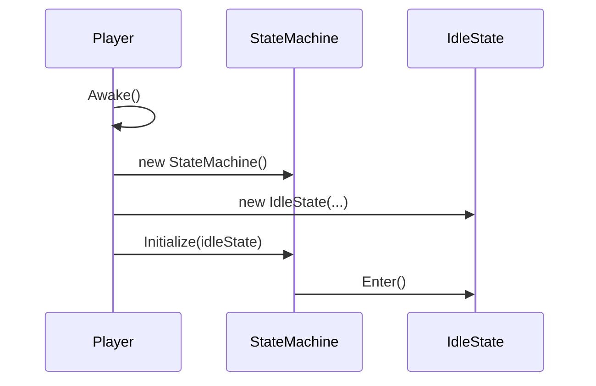
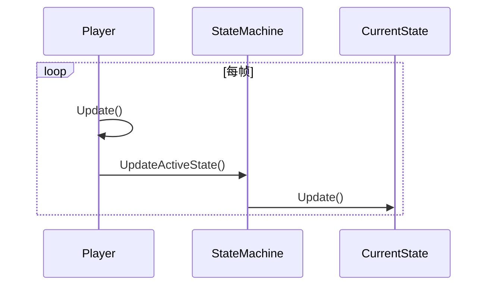
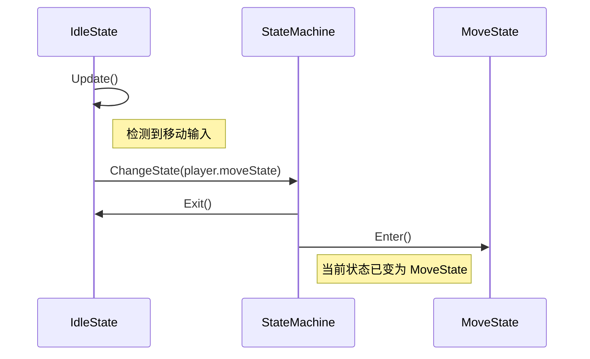

# 关于状态机

本文档旨在说明项目中用于控制实体（如玩家）行为的状态机系统的设计和实现方式。

## 概述

本状态机系统采用经典的**状态模式**，通过将不同行为逻辑封装到独立的状态类中，实现了代码的高度模块化和可扩展性。主要由以下三个核心部分组成：

- **StateMachine**: 状态管理器，负责当前状态的持有、更新和切换
- **EntityState**: 所有具体状态的基类，定义了状态的生命周期方法
- **Player**: 状态机的持有者和上下文，负责初始化状态机并驱动其更新
## 核心组件

### 1. StateMachine.cs

该类是状态机的核心控制器。

- **currentState**: EntityState 类型的属性，用于存储和访问当前激活的状态
- **Initialize(EntityState startState)**: 初始化方法，设置状态机的初始状态。通常在游戏对象 Awake 或 Start 时调用
- **ChangeState(EntityState newState)**: 核心的状态切换方法。先调用当前状态的 Exit() 方法，然后将 currentState 更新为新状态，最后调用新状态的 Enter() 方法
- **UpdateActiveState()**: 在 Player 的 Update 方法中被调用，负责执行当前状态的 Update() 逻辑
### 2. EntityState.cs

这是一个抽象基类，所有具体的状态（如 IdleState、MoveState 等）都必须继承自它。

- **构造函数** `EntityState(Player player, StateMachine stateMachine, string animBoolName)`: 初始化时需要传入 Player 引用、StateMachine 引用和一个用于动画控制的布尔参数名
- **Enter()**: 虚方法。当状态机切换到此状态时被调用。通常用于设置动画、初始化变量等
- **Update()**: 虚方法。在状态机处于此状态时，每帧被调用。用于处理该状态下的主要逻辑，如响应输入、检查转换条件等
- **Exit()**: 虚方法。当状态机离开此状态时被调用。通常用于重置动画、清理资源等
### 3. Player.cs

Player 类是 MonoBehaviour，作为状态机的上下文和驱动者。

- 它持有一个 StateMachine 实例
- 它为游戏中存在的每一种 EntityState 都创建并持有一个实例（例如 idleState、moveState、dashState 等）
- 在 Awake() 或 Start() 方法中，完成所有状态的实例化，并调用 `stateMachine.Initialize()` 来设置初始状态
- 在 Update() 方法中，调用 `stateMachine.UpdateActiveState()`，从而驱动整个状态机的运行

## 工作流程

### 1. 初始化流程



### 2. 状态更新流程



### 3. 状态切换流程（例如：从 Idle 到 Move）



## 如何添加一个新状态

遵循以下步骤来为 Player 添加一个新的行为状态：

### 1. 创建新状态类

创建一个新的 C# 脚本，例如 `NewState.cs`，使其继承自 `EntityState`。

```csharp
public class NewState : EntityState
{
    public NewState(Player player, StateMachine stateMachine, string animBoolName) : base(player, stateMachine, animBoolName)
    {
    }

    public override void Enter()
    {
        base.Enter();
        // 新状态进入时的逻辑
    }

    public override void Update()
    {
        base.Update();
        // 新状态每帧的逻辑
        // 在这里检查切换到其他状态的条件
    }

    public override void Exit()
    {
        base.Exit();
        // 离开新状态时的清理逻辑
    }
}
```

### 2. 在 Player.cs 中声明和实例化

在 `Player.cs` 中添加新状态的属性，并在 `Awake()` 方法中初始化它。

```csharp
public class Player : MonoBehaviour
{
    // ... 其他状态
    public EntityState newState { get; private set; }

    private void Awake()
    {
        // ...
        stateMachine = new StateMachine();
        idleState = new IdleState(this, stateMachine, "Idle");
        moveState = new MoveState(this, stateMachine, "Move");
        // ... 其他状态的实例化

        newState = new NewState(this, stateMachine, "NewStateAnim"); // 实例化新状态
    }

    private void Start()
    {
        stateMachine.Initialize(idleState); // 设置初始状态
    }
    // ...
}
```

### 3. 添加状态转换逻辑

在需要转换到 `NewState` 的其他状态（例如 `IdleState`）的 `Update()` 方法中，添加转换条件和调用。

```csharp
// In IdleState.cs or another state file
public override void Update()
{
    base.Update();

    if (someConditionIsMet) // 例如，按下某个键
        stateMachine.ChangeState(player.newState);
}
```

## 关于碰撞检测

**实现方式**: 在 `Update()` 方法中，通过 `HandleCollisionDetection()` 函数持续进行。它使用 **Physics2D.Raycast** 向特定方向发射射线来检测碰撞。

### 地面检测

- 从玩家的 `transform.position` 向下发射一条射线
- 检测距离由 `groundCheckDistance` 控制
- 检测结果存储在布尔值 `groundDetected` 中

### 墙壁检测

- 为了更稳定地检测墙壁，系统使用了两条射线进行检测
- 射线起点分别位于 `primaryWallDetected` 和 `secondaryWallDetected` 这两个 Transform 的位置
- 射线方向根据玩家朝向 `facingDir` 决定（左或右）
- 检测距离由 `wallCheckDistance` 控制
- 只有当两条射线同时检测到墙壁时，`wallDetected` 才为 true

## 关于连招

### Coroutine 和 IEnumerator

Coroutine（协程）和 IEnumerator 是 Unity 中实现异步或延时操作的关键工具。

#### IEnumerator

`EnterAttackStateWithDelyCo()` 的返回类型是 `IEnumerator`。

- 可以看作**协程**版本的**函数**
- 这是一个可以被"暂停"和"继续"的函数
- **yield return** 语句就是它的"暂停点"
- 在这之前的语句正常执行，这之后的在特定条件发生/到达后执行
- 相比正常的函数，不能直接进行调用，只能使用标准库中的 `StartCoroutine()` 进行调用

#### Coroutine

协程的类。`queuedAttackCo` 的类型是 `Coroutine`。它是由 `StartCoroutine()` 返回的对象，代表一个正在运行的协程实例。你可以通过这个对象来管理协程，最常见的就是使用 `StopCoroutine()` 来提前终止它。
